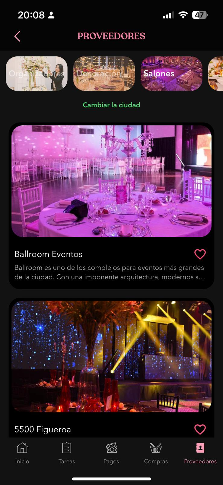
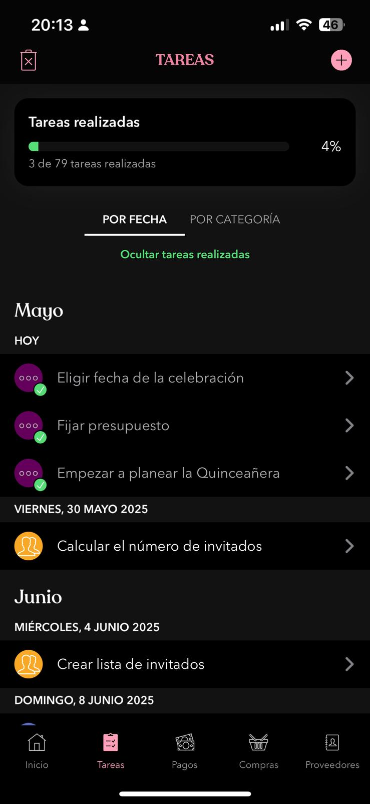
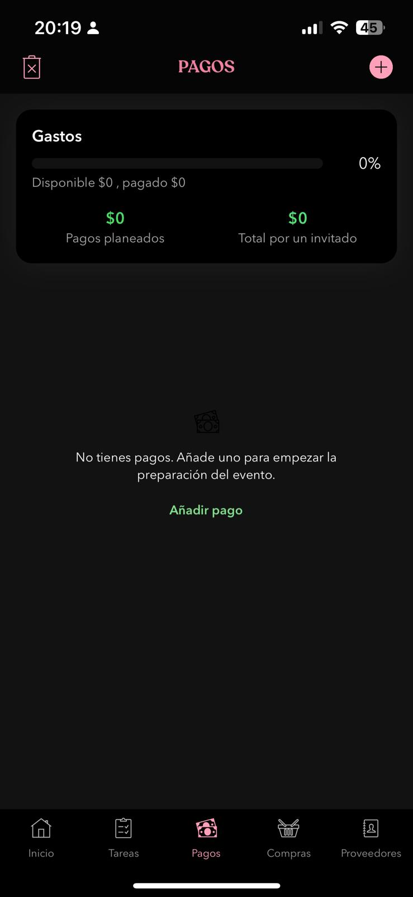
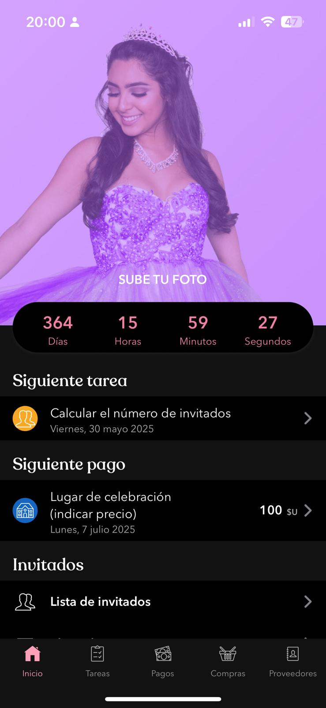
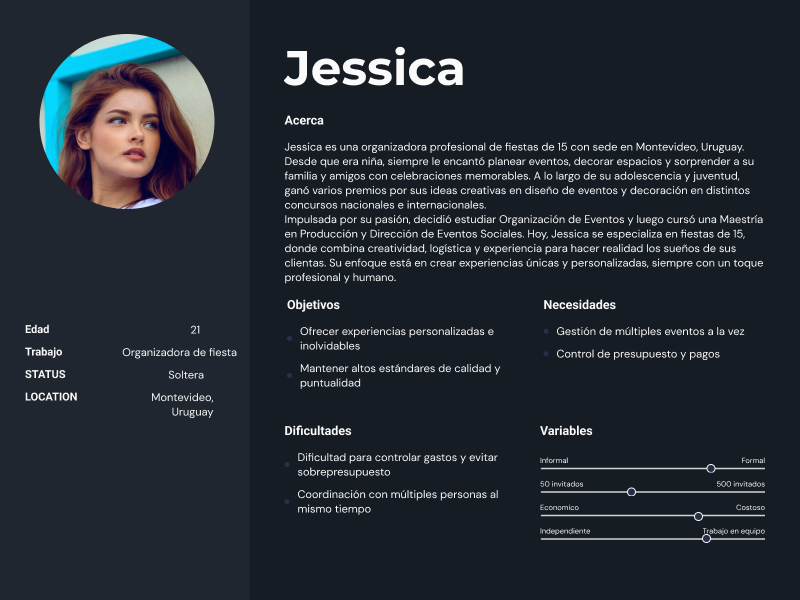
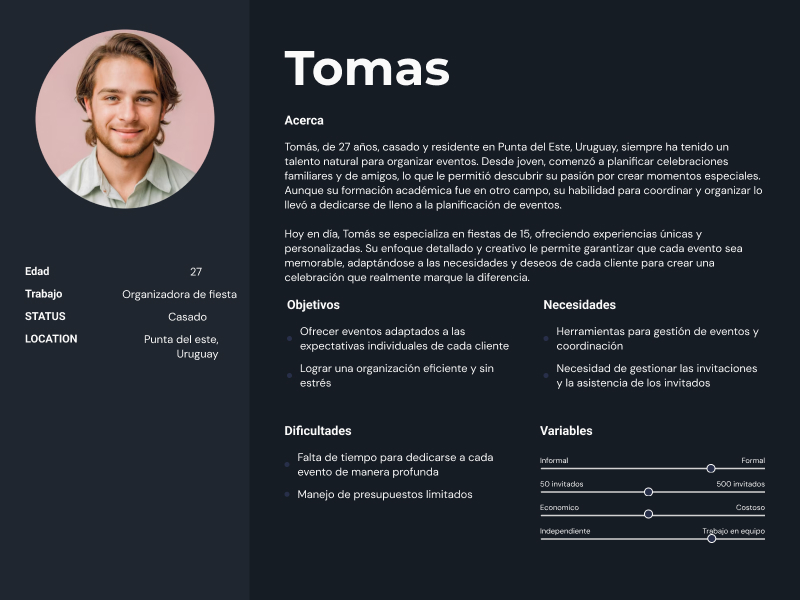
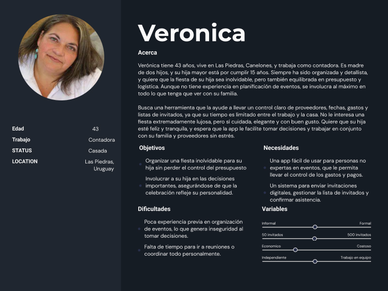

# Informe Académico (entrega 1)
## Integrantes del equipo: Antonio Caiafa, Mateo Nicodella, Juan Manuel Rial

## Repositorio Git

## Investigación

### Técnicas de elicitación: Entrevista

#### Entrevista 1:

El 24 de abril del 2025 fue el dia en el que se entrevisto a Ana Maria Oyarbide, el objetivo de esta entrevista fue aprender sobre la experiencia que tuvo, la cuál fue planificar un cumpleaños de 15 para su hija acá en Montevideo Uruguay. Nos intereso saber qué cosas priorizo sobre otras, si la comida fue lo más importante o tal vez el lugar, entre otras muchas otras cosas, aparte nos intereso saber qué dificultades se presentaron y cómo las resolvieron.

El plan consistía en hacerle preguntas a la entrevistada respecto a su experiencia, para que sirvan como para empezar una conversación con la entrevistada respecto al tema de la pregunta. En su mayoría los temas eran los invitados, como mandaban las invitaciones, como eran las respuestas, como se administraba todo, había dificultades con algún invitado, etc. También está el manejo de la plata, como cuál era el presupuesto, se hizo un gasto innecesario, hay algo que le hubiese podido comprar pero no lo hizo, etc.

Para resumir, lo que nos compartió la entrevistada fue que, hay que llevar un control sobre todo lo importante, ya sea sobre los invitados, si estos confirmaron su asistencia o no, si uno de ellos tiene una limitación ya sea este vegetariano, celíaco, etc., ya sea sobre los gastos, si todo cabe dentro del presupuesto, si da lo suficiente tal vez darse un gusto. Otra cosa a destacar que la entrevistada menciona es que si es posible comprar el lugar, el servicio y la comida de un mismo paquete, ya que es más confiable y al mismo tiempo más eficiente.

#### Entrevista 2:

Siguiendo con el objetivo anterior entrevista, realizamos otra entrevista con el mismo formato el 30 de abril de 2025, a una madre de una hija la cual tuvo la suerte que su madre le planificara su cumpleaños. Lo que se le pregunto fue, que fue más difícil al momento de planificar una fiesta de 15 años. También consultamos cuál fue el punto más importante respecto al presupuesto y si a día de hoy, teniendo ya la experiencia de haber organizado todo, lo realizaría de otra forma.

Podemos concluir que lo mejor para quien organiza estos eventos es contratar un espacio que incluya lo máximo posible, ya que allí se unifican las cosas y se puede organizar todo con las mismas personas o herramientas, lo mejor es enviar invitaciones de manera electrónica con opciones para confirmar asistencia allí mismo y también mencionar si tienen alguna restricción alimenticia, guardando esto con los datos de cada persona, de esa forma llega toda la información directo al local y se ahorran los malentendidos.
Se sabe también que el tema del presupuesto es algo a evaluar por quien va a organizar la fiesta y lo mejor es siempre presentar planes donde se pueda dejar un pequeño margen de dinero para posibles contratiempos o detalles para agregar.

### Técnicas de elicitación: Ingeniería Inversa

La aplicación quincy consiste en 5 paginas, Inicio, Tareas, Pagos, Compras, Proveedores. En la página proveedores, primero te preguntan tu localización, al completar eso, te aparecerá Organizacion, Decoracion, Salones, Catering y Música. Al presionar uno de ellos, opciones del elegido cerca de su zona, cada uno tendrá una imagen, un título, una descripción y un botón corazón. Al presionar uno le aparecerá la opción de contactar a ese proveedor.

Después tenemos tareas, al seleccionar esta página le aparecerá una lista con las tareas a realizar estas se pueden ordenar por fecha o por categoría. Cada tarea tiene un nombre, una fecha, una categoría y una nota, al presionar una se puede marcar como realizada, o no realizada. Arriba a las esquinas se pueden agregar tareas o eliminarlas, sin mencionar que arriba de la lista hay una barra de progreso que muestra el porcentaje que llevan, cuantas de las tareas llevan realizadas, una buena herramienta para supervisar todo.

Más adelante tenemos pagos, en esta página se lleva en cuenta todos los pagos que se hacen. Arriba a las esquinas se pueden ver las opciones de borrar y crear pagos, otra cosa es que arriba de los pagos te llevan la cuenta de cuanto ya está pago y cuanto queda por pagar. Los pagos tienen un nombre, una fecha, el precio a pagar, cuánto va pagado, a qué categoría pertenece y una nota.

Como cuarta página tenemos compras, compras se divide en dos páginas, lista de compras y lista de regalos. En ambas páginas te mostrarán las compras o regalos decididos, estos se muestran con una imagen con un nombre abajo, aparte que al presionarlo te darán la opción de ir a la página web de donde salieron. Algo a mencionar es que en la parte de abajo de ambas páginas hay opciones que te dan la página que puedes elegir si es a tu gusto. Finalmente, en la esquina arriba a la derecha tenemos la opción de agregar uno manualmente.

Finalmente, tenemos el inicio, lo primero que se ve es una cuenta atrás que va hasta la fecha del cumple junto una foto de la cumpleañera. Después tenemos los siguientes subtítulos, “siguiente tarea”, “invitados”, “el día de evento”, “inspiración & guías” y “administración”. 
En “siguiente tarea”, te muestran la próxima tarea a completar, la tarea cuya fecha está más próxima.
En “invitados” tenemos las opciones de armar la lista de invitados, para agregar un invitado puede ser ya de tus contactos o puedes agregarlos manualmente, se guarda el nombre, su estado(invitado, no asistirá o a confirmar asistencia), la cantidad de acompañantes y la cantidad de niños. Después tenemos la planificación de asientos, que te da la opción de planificar cómo serán las mesas, cuántas personas ocupan una mesa y quienes la ocupan. Finalmente tenemos la invitacion, esta te da una plantilla a completar, la fecha límite de confirmación de asistencia, decidir cuántos acompañante y niños puede traer un invitado y finalmente se manda vía mail.
En “El día del evento” puedes ver como está predicho el timing y el clima, además de poder ver la playlist que se correrá en el cumpleaños.
En “inspiración & guías”, te dan unas guías y consejos a tener en cuenta y la capacidad de guardar notas para vos mismo.
Al final de todo tenemos “administración”, acá tenemos la capacidad de ver el perfil de la quinceañera, de exportar datos, ver los ajustes, cambiar el diseño de la aplicación, invitar a otros que te ayuden a organizar dándoles unos roles asignados, cambiar el idioma de la aplicación, darle las gracias a la aplicación y finalmente cerrar sesión.

### Users Persona

### Conclusión:
De las entrevistas realizadas pudimos concluir que las necesidades más recurrentes de los usuarios listados son con respecto a las invitaciones y la gestión de las mismas, así como llevar un registro de los gastos y así poder gestionar mejor en que asignar el presupuesto. Con el fin de simplificar la organización y así centrar más atención en otros aspectos del mismo.
Otro descubrimiento que se identificó de las entrevistas fueron los user persona que utilizan la aplicación son los:
- organizadores
- invitados

## RN & RNF
Los requisitos funcionales son aquellas funciones que la aplicación debe cumplir, es decir, todo lo que el sistema tiene que hacer para resolver el problema planteado. Por ejemplo, permitir enviar invitaciones, confirmar asistencia o registrar restricciones alimentarias. Por otro lado, los requisitos no funcionales definen cómo debe comportarse la aplicación, como su facilidad de uso, la seguridad de los datos o que funcione bien desde el celular. Estos no indican nuevas funciones, sino que aseguran que el sistema funcione de manera eficiente y confiable.

La prioridad alta indica que es esencial para la funcionalidad del sistema. La prioridad media indica que el requisito es importante y mejora la experiencia del usuario, pero no es crítico para el funcionamiento básico. La prioridad baja es para funcionalidades que pueden ser opcionales que pueden implementarse en versiones posteriores.

El actor es quien realiza la acción principal de cada requisito. El actor puede ser el usuario, el organizador, el invitado o el sistema.

<h3 align="center">Requerimientos Funcionales:</h3>

<strong>#RF01: Registro de evento.</strong> 
Descripción: El sistema debe permitir al usuario la creación de un evento indicando fecha, lugar, temática y datos de contacto. 
Prioridad: alta. 
Actor: Organizador.

<strong>#RF02: Envío de invitaciones digitales</strong> 
El sistema debe permitir enviar invitaciones por medios digitales (WhatsApp, mail o enlace). 
Prioridad: alta. 
Actor: Sistema.

<strong>#RF03: Confirmación de asistencia</strong> 
El sistema debe administrar la confirmación o rechazo de la invitación por parte del invitado. 
Prioridad: alta. 
Actor: Invitado.

<strong>#RF04: Registro de restricciones alimentarias</strong> 
Cada invitado podrá informar si tiene alguna restricción (celíaco, vegetariano, alérgico, etc.). 
Prioridad: media. 
Actor: Invitado.

<strong>#RF05: Asignación de mesas</strong> 
El organizador podrá asignar invitados a distintas mesas con una interfaz gráfica. 
Prioridad: alta. 
Actor: Organizador.

<strong>#RF06: Envío de recordatorios y notificaciones</strong> 
El sistema enviará recordatorios automáticos antes del evento. 
Prioridad: media. 
Actor: Sistema.

<strong>#RF07: Gestión de cambios de último momento</strong> 
El sistema podrá notificar a los invitados sobre cambios (clima, lugar, hora). 
Prioridad: alta. 
Actor: Sistema.

<strong>#RF08: Panel de control del evento</strong> 
Vista resumen con cantidad de confirmaciones, pendientes, restricciones, etc. 
Prioridad: alta. 
Actor: Sistema.

<strong>#RF09: Personalización de invitaciones</strong> 
Posibilidad de agregar fotos, textos, colores y temática personalizada. 
Prioridad: baja. 
Actor: Organizador.

<strong>#RF10: Gestión de presupuesto</strong> 
El sistema permitirá al usuario cargar y gestionar el presupuesto registrando los gastos. 
Prioridad: media. 
Actor: Organizador.

<strong>#RF11: Registro de cambios del evento</strong> 
El sistema debe registrar el historial de modificaciones del evento (fecha, lugar, catering) con usuario, tipo de cambio y fecha. 
Prioridad: alta. 
Actor: Sistema.

<strong>#RF12: Gestión de pagos asociados</strong> 
El sistema debe permitir gestionar los pagos de lugar, catering y servicios dentro del módulo de presupuesto. 
Prioridad: media. 
Actor: Sistema.

<strong>#RF13: Gestión de restricciones alimentarias</strong> 
El sistema debe almacenar y mostrar las restricciones alimentarias por invitado, visibles al catering y al organizador. 
Prioridad: alta. 
Actor: Sistema.

<strong>#RF14: Actualización en tiempo real</strong> 
Los cambios realizados por el organizador deben reflejarse en tiempo real en la vista de los usuarios conectados. 
Prioridad: alta. 
Actor: Sistema.

<h3 align="center">Requerimientos No Funcionales:</h3>

<strong>#RNF01: Usabilidad</strong> 
La interfaz debe permitir completar las tareas básicas (crear evento, enviar invitaciones, confirmar asistencia) en no más de 5 pasos, con texto claro, botones visibles y confirmaciones visuales.

<strong>#RNF02: Accesibilidad</strong> 
El sistema debe ser accesible para navegadores Chrome (version 90 o superior) y Safari (version 13 o superior). 
Prioridad: alta.

<strong>#RNF03: Seguridad</strong> 
El sistema debe otorgar protección y seguridad de datos, cumpliento los requisitos de la Ley N° 18.331 de protección de datos. 
Prioridad: alta.

<strong>#RNF04: Escalabilidad y Rendimiento</strong> 
El sistema debe poder actualizarse para agregar nuevas funcionalidades y mayor capacidad de usuarios sin afectar los tiempos de ejecución y rendimiento. 
Prioridad: media.

<strong>#RNF05: Tiempos de Carga</strong> 
Todas las visitas deben cargarse en menos de 2 segundos con conexión estándar, siendo capaz de manejar hasta 6000 usuarios interactuando simultáneamente sin afectar el rendimiento. 
Prioridad: media.

<strong>#RNF06: Diseño y Asistencia inicial</strong> 
El sistema debe tener un diseño intuitivo, los menús deben ser claros y sencillos. Además, el sistema debe incluir un breve tutorial inicial que guíe al usuario en los primeros pasos del uso de la aplicación. 
Prioridad: alta.

<strong>#RNF07: Disponibilidad</strong> 
El sistema debe estar disponible el 99% del tiempo. 
Prioridad: alta.

<strong>#RNF08: Idioma</strong> 
La aplicación debe estar disponible en español. 
Prioridad: alta.

## User Stories & Use Cases

| #RF01 | Registro de evento. |
|---|--------------------|
| Descripción | El sistema debe permitir al usuario la creación de un evento indicando fecha, lugar, temática y datos de contacto. |
| Actores | Organizador |
| Precondiciones | - |
| Post condiciones | El evento queda registrado en el sistema |
| Curso normal | Acción (actor): Ingresa a "Crear evento"   Reacción (sistema): Muestra formulario   Acción (actor): Completa fecha, lugar, temática, datos   Reacción (sistema): Guarda evento y redirige al panel |
| Curso alternativo | Acción (actor): Deja campos vacíos   Reacción (sistema): Muestra mensaje de error y no guarda |

| #RF02 | Envío de invitaciones digitales |
|--|--|
| Como | Organizador del evento |
| Quiero | enviar invitaciones digitales por WhatsApp, mail o enlace |
| Para | que los invitados puedan acceder fácilmente a la información del evento |
| Criterios de aceptación | - El sistema debe generar un enlace único por invitado   - Debe permitir compartir por múltiples plataformas   - Las invitaciones deben estar asociadas al evento correcto |

| #RF03 | Confirmación de asistencia |
|--|--|
| Como | Invitado |
| Quiero | confirmar o rechazar la invitación al evento |
| Para | que el organizador sepa si voy a asistir |
| Criterios de aceptación | - Debe poder acceder al estado de su respuesta   - El sistema debe registrar y notificar al organizador |

| #RF04 | Registro de restricciones alimentarias |
|--|--|
| Como | Invitado |
| Quiero | indicar si tengo alguna restricción alimentaria |
| Para | que el organizador y el catering lo tengan en cuenta |
| Criterios de aceptación | - El sistema debe ofrecer una lista de restricciones comunes   - Debe guardar la restricción asociada al invitado |

| #RF05 | Asignación de mesas |
|--|--|
| Como | Organizador |
| Quiero | asignar invitados a distintas mesas con una interfaz visual |
| Para | organizar mejor la disposición del evento |
| Criterios de aceptación | - Debe permitir arrastrar y soltar invitados   - Debe guardar la configuración por evento |

| #RF06 | Envío de recordatorios y notificaciones |
|--|--|
| Como | Sistema |
| Quiero | enviar recordatorios automáticos a los invitados |
| Para | asegurarme de que no olviden el evento |
| Criterios de aceptación | - Debe enviarse con antelación configurable   - El mensaje debe incluir datos del evento |

| #RF07 | Gestión de cambios de último momento |
|--|--|
| Como | Sistema |
| Quiero | notificar a los invitados sobre cambios importantes |
| Para | que estén al tanto de imprevistos como cambios de hora o lugar |
| Criterios de aceptación | - El mensaje debe enviarse apenas se registra un cambio   - Debe incluir qué cambió y cuándo |

| #RF08 | Panel de control del evento |
|---|--------------------|
| Descripción | Vista resumen con cantidad de confirmaciones, pendientes, restricciones, etc. |
| Actores | Sistema |
| Precondiciones | Evento ya creado y con datos cargados |
| Post condiciones | Se visualiza información consolidada del evento |
| Curso normal | Acción (actor): Ingresa al panel desde el menú   Reacción (sistema): Muestra confirmaciones, restricciones, etc. |
| Curso alternativo | Acción (actor): Evento no tiene datos aún   Reacción (sistema): Muestra mensaje "No hay datos aún disponibles" |

| #RF09 | Personalización de invitaciones |
|--|--|
| Como | Organizador |
| Quiero | personalizar el diseño de las invitaciones |
| Para | que reflejen la temática del evento |
| Criterios de aceptación | - Debe permitir elegir colores, textos e imágenes   - Debe aplicar a todas las invitaciones del evento |

| #RF10 | Gestión de presupuesto |
|--|--|
| Como | Organizador |
| Quiero | registrar y gestionar los gastos del evento |
| Para | controlar el presupuesto disponible |
| Criterios de aceptación | - Debe permitir registrar categoría, monto y proveedor   - Debe mostrar un resumen de gastos vs. presupuesto |

| #RF11 | Registro de cambios del evento |
|---|--------------------|
| Descripción | El sistema debe registrar el historial de modificaciones del evento (fecha, lugar, catering) con usuario, tipo de cambio y fecha. |
| Actores | Sistema |
| Precondiciones | Evento existente |
| Post condiciones | Se almacena un historial del cambio realizado |
| Curso normal | Acción (actor): Modifica fecha del evento   Reacción (sistema): Guarda usuario, tipo de cambio y fecha |
| Curso alternativo | Acción (actor): Cancela modificación   Reacción (sistema): No se registra ningún cambio |

| #RF12 | Gestión de pagos asociados |
|---|--------------------|
| Descripción | El sistema debe permitir gestionar los pagos de lugar, catering y servicios dentro del módulo de presupuesto. |
| Actores | Sistema |
| Precondiciones | Presupuesto creado previamente |
| Post condiciones | Se actualiza el estado de pagos |
| Curso normal | Acción (actor): Agrega nuevo pago (catering)   Reacción (sistema): Actualiza total de presupuesto usado |
| Curso alternativo | Acción (actor): Omite campos obligatorios   Reacción (sistema): No permite guardar y muestra error |

| #RF13 | Gestión de restricciones alimentarias |
|---|--------------------|
| Descripción | El sistema debe almacenar y mostrar las restricciones alimentarias por invitado, visibles al catering y al organizador. |
| Actores | Sistema |
| Precondiciones | Invitados ya registraron restricciones |
| Post condiciones | Se visualizan correctamente al planificar menú |
| Curso normal | Acción (actor): Accede a la lista de invitados   Reacción (sistema): Muestra restricciones alimentarias |
| Curso alternativo | Acción (actor): Invitado no registró restricción   Reacción (sistema): Muestra mensaje "Sin restricciones" |

| #RF14 | Actualización en tiempo real |
|---|--------------------|
| Descripción | Los cambios realizados por el organizador deben reflejarse en tiempo real en la vista de los usuarios conectados. |
| Actores | Sistema |
| Precondiciones | Usuarios deben estar conectados al sistema |
| Post condiciones | Cambios reflejados sin recargar página |
| Curso normal | Acción (actor): Cambia lugar del evento   Reacción (sistema): Todos los usuarios ven el nuevo lugar al instante |
| Curso alternativo | Acción (actor): Usuario sin conexión   Reacción (sistema): No ve cambios hasta volver a conectarse |

## Modelo de dominio

## Verificación & Validación

## Descripción del Trabajo Individual

## Reflexión
---
## Anexo

#### Preguntas para entrevista

- ¿Cómo fue la experiencia general de organizar el evento?
- ¿Qué es lo más complicado al momento de planear la fiesta?
- ¿Qué fue lo más difícil o estresante de organizar el cumpleaños?
- ¿Cuánto tiempo te llevó planificar todo?
- ¿Cómo enviaste las invitaciones?
- ¿Tuviste problemas para que la gente confirme asistencia?
- ¿Cómo llevaste el control de quién venía y quién no?
- ¿Hubo cambios de último momento? 
- ¿Cómo se los comunicaste a los invitados?
- ¿Alguien te avisó si tenía alguna restricción alimentaria? 
- ¿Cómo lo registraste?
- ¿Cómo organizaste la distribución de las mesas?
- ¿Utilizaste alguna aplicación o herramienta digital para ayudarte? Si usaste alguna, ¿qué te gustó y qué no?
- Si existiera una app que te ayudará a enviar invitaciones, llevar el control de invitados, mesas y gastos, ¿la habrías usado?
- Si pudieras repetir el evento, ¿qué harías diferente?
- ¿Sentís que pudiste disfrutar el evento o estuviste pendiente de la organización?
- ¿Tuviste algún presupuesto definido desde el inicio? ¿De cuanto era?
- ¿Hubo gastos inesperados o fuera de presupuesto? ¿Cuáles?
- ¿Qué cosas te hubiera gustado tener pero no pudiste por el precio?
- ¿En qué cosas gastaste más dinero?
- ¿Si tuvieras que organizar otro evento, como manejarias el presupuesto de manera diferente?
- ¿Cuáles eran tus prioridades al momento de elegir el salón para la fiesta?
- ¿Qué comodidades o servicios te parecían indispensables en un salón para que todo salga bien?
- ¿Preferiste un salón que ofreciera paquetes completos o contrataste servicios por separado? 