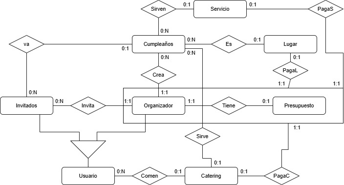

# Informe Académico (entrega 1)
## Integrantes del equipo: Antonio Caiafa, Mateo Nicodella, Juan Manuel Rial

## Repositorio Git

## Investigación

### Técnicas de elicitación: Entrevista

#### Entrevista 1:

El objetivo de esta entrevista es aprender de la experiencia de la entrevistada, sobre cuál fue su experiencia al planificar un cumpleaños de 15 para su hija acá en Montevideo Uruguay. Nos interesa saber qué cosas priorizar sobre otras, si la comida es lo más importante o tal vez el lugar, entre otras muchas otras cosas, aparte nos interesa saber qué dificultades se presentaron y cómo las resolvieron.

El plan consistía en hacerle preguntas a la entrevistada respecto a su experiencia, para que sirvan como para empezar una conversación con la entrevistada respecto al tema de la pregunta. En su mayoría los temas eran los invitados, como mandaban las invitaciones, como eran las respuestas, como se administraba todo, había dificultades con algún invitado, etc. También está el manejo de la plata, como cuál era el presupuesto, se hizo un gasto innecesario, hay algo que le hubiese podido comprar pero no lo hizo, etc.

Para resumir, lo que nos compartió la entrevistada fue que, hay que llevar un control sobre todo lo importante, ya sea sobre los invitados, si estos confirmaron su asistencia o no, si uno de ellos tiene una limitación ya sea este vegetariano, celíaco, etc., ya sea sobre los gastos, si todo cabe dentro del presupuesto, si da lo suficiente tal vez darse un gusto. Otra cosa a destacar que la entrevistada menciona es que si es posible comprar el lugar, el servicio y la comida de un mismo paquete, ya que es más confiable y al mismo tiempo más eficiente.

#### Entrevista 2:

Siguiendo con el objetivo anterior, realizamos otra entrevista con el mismo formato, consultando qué resultó más difícil al momento de planificar una fiesta de 15 años. También consultamos cuál fue el punto más importante respecto al presupuesto y si a día de hoy, teniendo ya la experiencia de haber organizado todo, lo realizaría de otra forma.
Podemos concluir que lo mejor para quien organiza estos eventos es contratar un espacio que incluya lo máximo posible, ya que allí se unifican las cosas y se puede organizar todo con las mismas personas o herramientas, lo mejor es enviar invitaciones de manera electrónica con opciones para confirmar asistencia allí mismo y también mencionar si tienen alguna restricción alimenticia, guardando esto con los datos de cada persona, de esa forma llega toda la información directo al local y se ahorran los malentendidos.
Se sabe también que el tema del presupuesto es algo a evaluar por quien va a organizar la fiesta y lo mejor es siempre presentar planes donde se pueda dejar un pequeño margen de dinero para posibles contratiempos o detalles para agregar.

### Técnicas de elicitación: Ingeniería Inversa
*(a futuro app quincy)*

### Conclusión:
De las entrevistas realizadas pudimos concluir que las necesidades más recurrentes de los usuarios listados son con respecto a las invitaciones y la gestión de las mismas, así como llevar un registro de los gastos y así poder gestionar mejor en que asignar el presupuesto. Con el fin de simplificar la organización y así centrar más atención en otros aspectos del mismo.
Otro descubrimiento que se identificó de las entrevistas fueron los user persona que utilizan la aplicación son los:
- organizadores
- invitados

## RN & RNF
Los requisitos funcionales son aquellas funciones que la aplicación debe cumplir, es decir, todo lo que el sistema tiene que hacer para resolver el problema planteado. Por ejemplo, permitir enviar invitaciones, confirmar asistencia o registrar restricciones alimentarias. Por otro lado, los requisitos no funcionales definen cómo debe comportarse la aplicación, como su facilidad de uso, la seguridad de los datos o que funcione bien desde el celular. Estos no indican nuevas funciones, sino que aseguran que el sistema funcione de manera eficiente y confiable.

La prioridad alta indica que es esencial para la funcionalidad del sistema. La prioridad media indica que el requisito es importante y mejora la experiencia del usuario, pero no es crítico para el funcionamiento básico. La prioridad baja es para funcionalidades que pueden ser opcionales que pueden implementarse en versiones posteriores.

El actor es quien realiza la acción principal de cada requisito. El actor puede ser el usuario, el organizador, el invitado o el sistema.

<h3 align="center">Requerimientos Funcionales:</h3>

<strong>#RF01: Registro de evento.</strong> 
Descripción: El sistema debe permitir al usuario la creación de un evento indicando fecha, lugar, temática y datos de contacto. 
Prioridad: alta. 
Actor: Organizador.

<strong>#RF02: Envío de invitaciones digitales</strong> 
El sistema debe permitir enviar invitaciones por medios digitales (WhatsApp, mail o enlace). 
Prioridad: alta. 
Actor: Sistema.

<strong>#RF03: Confirmación de asistencia</strong> 
El sistema debe administrar la confirmación o rechazo de la invitación por parte del invitado. 
Prioridad: alta. 
Actor: Invitado.

<strong>#RF04: Registro de restricciones alimentarias</strong> 
Cada invitado podrá informar si tiene alguna restricción (celíaco, vegetariano, alérgico, etc.). 
Prioridad: media. 
Actor: Invitado.

<strong>#RF05: Asignación de mesas</strong> 
El organizador podrá asignar invitados a distintas mesas con una interfaz gráfica. 
Prioridad: alta. 
Actor: Organizador.

<strong>#RF06: Envío de recordatorios y notificaciones</strong> 
El sistema enviará recordatorios automáticos antes del evento. 
Prioridad: media. 
Actor: Sistema.

<strong>#RF07: Cambios del Evento</strong> 
El sistema le permitirá al organizador realizar cambios al evento. 
Prioridad: alta. 
Actor: Organizador.

<strong>#RF08: Gestión de cambios de último momento</strong> 
El sistema podrá notificar a los invitados sobre cambios (clima, lugar, hora). 
Prioridad: alta. 
Actor: Sistema.

<strong>#RF09: Panel de control del evento</strong> 
Vista resumen con cantidad de confirmaciones, pendientes, restricciones, etc. 
Prioridad: alta. 
Actor: Sistema.

<strong>#RF10: Personalización de invitaciones</strong> 
Posibilidad de agregar fotos, textos, colores y temática personalizada. 
Prioridad: baja. 
Actor: Organizador.

<strong>#RF11: Gestión de presupuesto</strong> 
El sistema permitirá al usuario cargar y gestionar el presupuesto registrando los gastos. 
Prioridad: media. 
Actor: Organizador.

<strong>#RF12: Registro de cambios del evento</strong> 
El sistema debe registrar el historial de modificaciones del evento (fecha, lugar, catering) con usuario, tipo de cambio y fecha. 
Prioridad: alta. 
Actor: Sistema.

<strong>#RF13: Gestión de pagos asociados</strong> 
El sistema debe permitir gestionar los pagos de lugar, catering y servicios dentro del módulo de presupuesto. 
Prioridad: media. 
Actor: Sistema.

<strong>#RF14: Gestión de restricciones alimentarias</strong> 
El sistema debe almacenar y mostrar las restricciones alimentarias por invitado, visibles al catering y al organizador. 
Prioridad: alta. 
Actor: Sistema.

<strong>#RF15: Actualización en tiempo real</strong> 
Los cambios realizados por el organizador deben reflejarse en tiempo real en la vista de los usuarios conectados. 
Prioridad: alta. 
Actor: Sistema.

<h3 align="center">Requerimientos No Funcionales:</h3>

<strong>#RNF01: Usabilidad</strong> 
La interfaz debe permitir completar las tareas básicas (crear evento, enviar invitaciones, confirmar asistencia) en no más de 5 pasos, con texto claro, botones visibles y confirmaciones visuales.

<strong>#RNF02: Accesibilidad</strong> 
El sistema debe ser accesible para navegadores Chrome (version 90 o superior) y Safari (version 13 o superior). 
Prioridad: alta.

<strong>#RNF03: Seguridad</strong> 
El sistema debe otorgar protección y seguridad de datos, cumpliento los requisitos de la Ley N° 18.331 de protección de datos. 
Prioridad: alta.

<strong>#RNF04: Escalabilidad y Rendimiento</strong> 
El sistema debe poder actualizarse para agregar nuevas funcionalidades y mayor capacidad de usuarios sin afectar los tiempos de ejecución y rendimiento. 
Prioridad: media.

<strong>#RNF05: Tiempos de Carga</strong> 
Todas las visitas deben cargarse en menos de 2 segundos con conexión estándar, siendo capaz de manejar hasta 6000 usuarios interactuando simultáneamente sin afectar el rendimiento. 
Prioridad: media.

<strong>#RNF06: Diseño y Asistencia inicial</strong> 
El sistema debe tener un diseño intuitivo, los menús deben ser claros y sencillos. Además, el sistema debe incluir un breve tutorial inicial que guíe al usuario en los primeros pasos del uso de la aplicación. 
Prioridad: alta.

<strong>#RNF07: Disponibilidad</strong> 
El sistema debe estar disponible el 99% del tiempo. 
Prioridad: alta.

<strong>#RNF08: Idioma</strong> 
La aplicación debe estar disponible en español. 
Prioridad: alta.

## User Stories & Use Cases

## Modelo de dominio

## Verificación & Validación

## Descripción del Trabajo Individual

## Reflexión
---
## Anexo

#### Preguntas para entrevista

- ¿Cómo fue la experiencia general de organizar el evento?
- ¿Qué es lo más complicado al momento de planear la fiesta?
- ¿Qué fue lo más difícil o estresante de organizar el cumpleaños?
- ¿Cuánto tiempo te llevó planificar todo?
- ¿Cómo enviaste las invitaciones?
- ¿Tuviste problemas para que la gente confirme asistencia?
- ¿Cómo llevaste el control de quién venía y quién no?
- ¿Hubo cambios de último momento? 
- ¿Cómo se los comunicaste a los invitados?
- ¿Alguien te avisó si tenía alguna restricción alimentaria? 
- ¿Cómo lo registraste?
- ¿Cómo organizaste la distribución de las mesas?
- ¿Utilizaste alguna aplicación o herramienta digital para ayudarte? Si usaste alguna, ¿qué te gustó y qué no?
- Si existiera una app que te ayudará a enviar invitaciones, llevar el control de invitados, mesas y gastos, ¿la habrías usado?
- Si pudieras repetir el evento, ¿qué harías diferente?
- ¿Sentís que pudiste disfrutar el evento o estuviste pendiente de la organización?
- ¿Tuviste algún presupuesto definido desde el inicio? ¿De cuanto era?
- ¿Hubo gastos inesperados o fuera de presupuesto? ¿Cuáles?
- ¿Qué cosas te hubiera gustado tener pero no pudiste por el precio?
- ¿En qué cosas gastaste más dinero?
- ¿Si tuvieras que organizar otro evento, como manejarias el presupuesto de manera diferente?
- ¿Cuáles eran tus prioridades al momento de elegir el salón para la fiesta?
- ¿Qué comodidades o servicios te parecían indispensables en un salón para que todo salga bien?
- ¿Preferiste un salón que ofreciera paquetes completos o contrataste servicios por separado? 